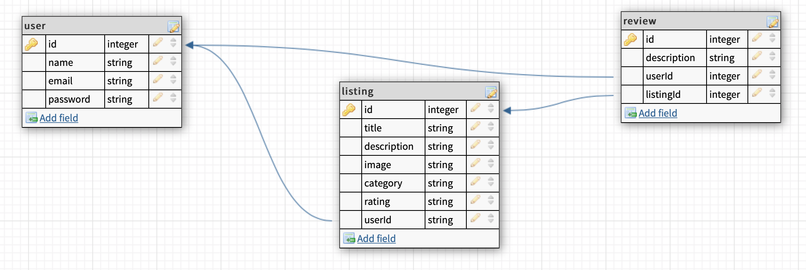

# Party List

## Overview
This app contains information about any party providers that people need to plan their events and parties.

## Wireframes

## User stories

1. When page loads, I see Home page.
2. When I'm in Home page, i see links for All listings, Signup and Login.
3. I can create a new profile, or login to an existing profile.
4. If I create a new profile, i need to fill out name, email and password.
5. For an existing profile, i fill out email and password and click Log in.
6. When I successfully logged in as a user, I can see All listings, My listings, Create and Logout links.
7. When I click on All listings i can see the list of all listings.
8. When I click on My listings, I can only see listings I created.
8. When I click on create, it will bring me to a new page with create listing form.
9. When i click on a single listing, I can see image, description, website, and social links as well as all reviews. I can write a review.
10. As a listing owner, i can edit and delete listing.
11. When I logout, i can see only Home, All listings, Signup and Login links.

## Routes inventory

|Method|Path|Description|
|---|---|---|
|POST|/users/signup|create new user|
|POST|/users/login|user login|
|GET|/users/verify|user verify|
|GET|/listings|see all listings|
|GET|/listings/my|see my listings|
|GET|/listing/:id|see single listing|
|POST|/listings/create|create new listing|
|PUT|/listings/:id|update listing|
|DELETE|/listing/:id|delete single listing|
|POST|/listings/:id/reviews|post review|
|GET|/listings/:id/reviews|get all reviews for single listing|

## Database ERD

## Frontend components tree

## MVP checklist

* create database
* create models
* make associations for models
* create routes and controllers
* sign up form
* login form
* Home page 
* Show list of all listings
* Show list of my listings
* Create, edit and delete listing
* Logout

## Stretch goals

* create reviews
* show reviews
* Search by zip code
* Categories
